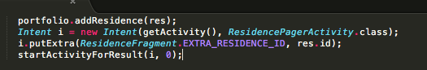

#Android Client (myrent-16-service)

In ResidenceListFragment, before refactoring we have:

```
  @Override
  public boolean onOptionsItemSelected(MenuItem item) {
    switch (item.getItemId()) {
      case R.id.menu_item_new_residence:
        Residence residence = new Residence();
        portfolio.addResidence(residence);
        Intent i = new Intent(getActivity(), ResidencePagerActivity.class);
        i.putExtra(ResidenceFragment.EXTRA_RESIDENCE_ID, residence.id);
        startActivityForResult(i, 0);
        return true;
```

This method remains unchanged. We provide it here to supply context:

```
  public void createResidence(Residence res) {
    Call<Residence> call = app.residenceService.createResidence(res);
    call.enqueue(this);
  }
```

The default Residence constructor generates a residence id.

- This is then passed to the ResidenceFragment as an extra in an intent.


We now require to obtain this id from the server. To achieve this we do the following:

- Create a residence on the server. 
- The residence object will have a valid id. We explain below how this is achieved.
- Echo back that residence.
- Furthermore, this cannot be done on the UI thread. Hence, we move the code into the Retrofit response as follows:

```

  @Override
  public boolean onOptionsItemSelected(MenuItem item) {
    switch (item.getItemId()) {
      case R.id.menu_item_new_residence:
        Residence residence = new Residence();
        createResidence(residence);
        return true;
```

```
  @Override
  public void onResponse(Response<Residence> response, Retrofit retrofit) {
    Residence res = response.body();
    if (res != null) {
      Toast.makeText(getActivity(), "Residence created successfully", Toast.LENGTH_SHORT).show();

      portfolio.addResidence(res);
      Intent i = new Intent(getActivity(), ResidencePagerActivity.class);
      i.putExtra(ResidenceFragment.EXTRA_RESIDENCE_ID, res.id);
      startActivityForResult(i, 0);

    }
    else {
      Toast.makeText(getActivity(), "Residence null returned due to incorrectly configured client", Toast.LENGTH_SHORT).show();

    }
  }

```

This is what existed prior to refactoring:

```
  @Override
  public void onResponse(Response<Residence> response, Retrofit retrofit) {
    Residence res = response.body();
    if (res != null) {
      Toast.makeText(getActivity(), "Residence created successfully", Toast.LENGTH_SHORT).show();
    }
    else {
      Toast.makeText(getActivity(), "Residence null returned due to incorrectly configured client", Toast.LENGTH_SHORT).show();

    }
  }

```

Observe what we have done. How the block of code shown in Figure 1 has been moved from the UI to a worker thread:



Test as follows:

- Run the service.
- Build and install MyRent-16 on an emulator (not a physical device).
- Create a new residence.
- Note the Toast message(s) to determine of successful.
- Open a brower and navigate to : localhost:9000/api/residences and view the json-formatted residences list.
- Use PostMan to look into the database.


##Server-side id generation

This is a snippet from the myrent-service-2016 ResidenceAPI. It demonstrates how an id is generated and used to initialize the Residence object being written to the database. The residence object containing this newly generated id is then echoed back to the caller.

```
  /**
   * 
   * @param id
   * @param body
   */
  public static void createResidence(JsonElement body) {
    Residence residence = gson.fromJson(body.toString(), Residence.class);
    Residence res = new Residence();
    residence.id = res.id;
    residence.save();
    renderJSON(gson.toJson(residence));
  }

```

